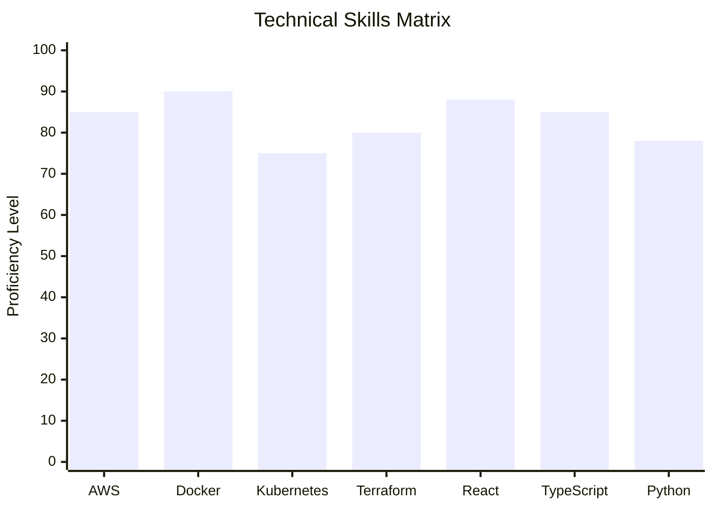
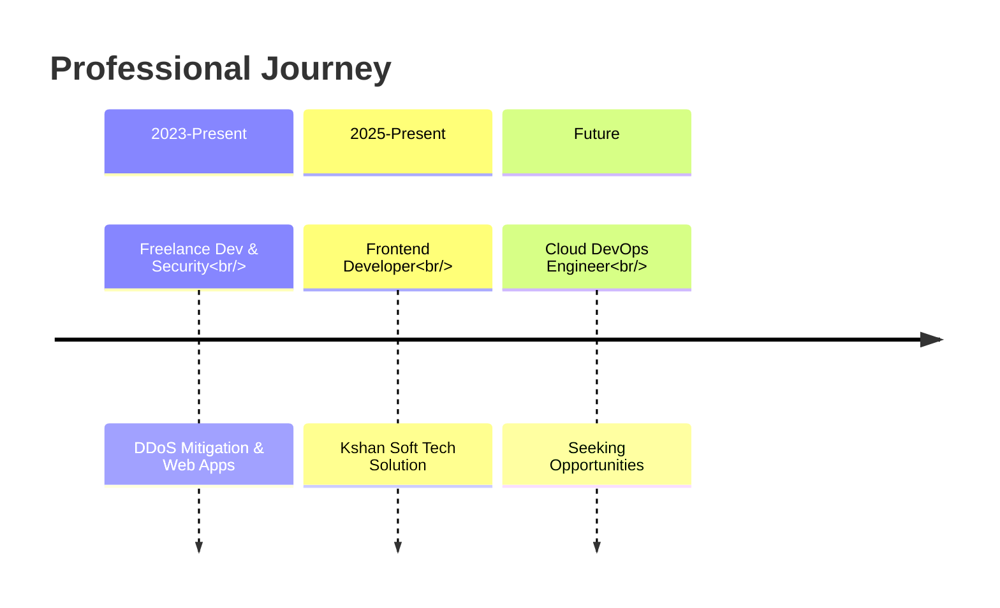

<div align="center">

## 👋 **Hello World! I'm Nehal Ingole**

### 🚀 **DevOps Engineer | Cloud Architect | Full Stack Developer**

<!-- 3D Animated Elements -->


<!-- Animated 3D Terminal -->
```bash
┌──(nehal㉿cloud)-
└─$ whoami
DevOps Engineer | Cloud Specialist | Tech Blogger
```

<!-- 3D Badge Grid -->
<div style="display: flex; justify-content: center; gap: 10px; margin: 20px 0;">
  
</div>

</div>

---

## 🏆 **Tech Stack Universe**

<!-- 3D Orbital Tech Stack -->
<div align="center">

| **🌐 Cloud Ecosystem** | **🛠️ DevOps Tools** | **💻 Development** |
|----------------------|-------------------|------------------|
|  |  |  |
|  |  |  |
|  |  |  |
|  |  |  |

</div>

<!-- Interactive Skills Chart -->
<details>
<summary><b>📊 Skills Proficiency (Click to Expand)</b></summary>



</details>

---

## 🚀 **Experience Timeline**

<!-- 3D Timeline -->
<div align="center">



</div>

### 💼 **Current Role Highlights**
- **🏗️ Infrastructure as Code**: Terraform modules for multi-cloud deployment
- **🐳 Container Orchestration**: Docker & Kubernetes for microservices
- **⚡ Performance Optimization**: 40% improvement in application load times
- **🔒 Security Implementation**: Web security & DDoS protection strategies

---

## 📚 **Featured Technical Articles**

<!-- 3D Article Cards -->
<div align="center">

| **Article** | **Tech Stack** | **Impact** |
|-------------|---------------|------------|
| **[Terraform + Vault Guide](https://learnwithnehal.hashnode.dev/)** |   | Secure infrastructure secrets management |
| **[Docker Swarm on AWS](https://learnwithnehal.hashnode.dev/)** |   | Scalable container orchestration |
| **[Hand Tracking Game](https://learnwithnehal.hashnode.dev/)** |   | Interactive AI-powered gaming |

</div>

---

## 📊 **GitHub Analytics Galaxy**

<!-- 3D Stats Visualization -->
<div align="center">

<!-- GitHub Stats with 3D effect -->
<div style="display: flex; justify-content: center; gap: 20px; flex-wrap: wrap;">
  

  


</div>

<!-- Contribution Graph with 3D effect -->


<!-- GitHub Streak Stats -->
[](https://git.io/streak-stats)

</div>

---

## 🎯 **Current Projects**

<!-- 3D Project Cards -->
<div align="center">

| **Project** | **Status** | **Tech Stack** | **Live Demo** |
|-------------|------------|----------------|---------------|
| **Cloud DevOps Pipeline** | 🔄 In Progress |    | [View](https://github.com/Ingole712521) |
| **Portfolio v3** | ✅ Completed |    | [Live](https://nehal-ingole.vercel.app/) |
| **Blog Platform** | 🔄 In Progress |    | [View](https://learnwithnehal.hashnode.dev/) |

</div>

---

## 🌐 **Connect With Me**

<!-- 3D Social Links -->
<div align="center">

<a href="https://nehal-ingole.vercel.app/">
  
</a>
<a href="https://www.linkedin.com/in/nehal-ingole/">
  
</a>
<a href="https://learnwithnehal.hashnode.dev/">
  
</a>
<a href="https://twitter.com/IngoleNehal">
  
</a>
<a href="mailto:your-email@example.com">
  
</a>

</div>

<!-- Visitor Counter with 3D animation -->
<div align="center" style="margin-top: 30px;">


<!-- GitHub Trophies -->
[](https://github.com/ryo-ma/github-profile-trophy)

</div>

---

<div align="center">

### 💫 **"Building Cloud-Native Futures, One Commit at a Time"**

<!-- Animated Quote -->
<div style="font-style: italic; color: #7B42BC; margin: 20px 0; padding: 15px; border-left: 4px solid #7B42BC; background: rgba(123, 66, 188, 0.1);">
    "The cloud is not just someone else's computer. It's a canvas where infrastructure becomes art."
</div>

⭐ **Star my repositories if you find something interesting!** ⭐

</div>
<div align="center">

**🚀 Thanks for visiting! Let's build something amazing together!**

[](https://star-history.com/#Ingole712521&Date)

</div>
